<head>
    <link rel="stylesheet" href="styles.css">
</head>

<body class="article">

    <h1>MIFARE Crypto1 Nested-auth attack deeper-dive</h1>
    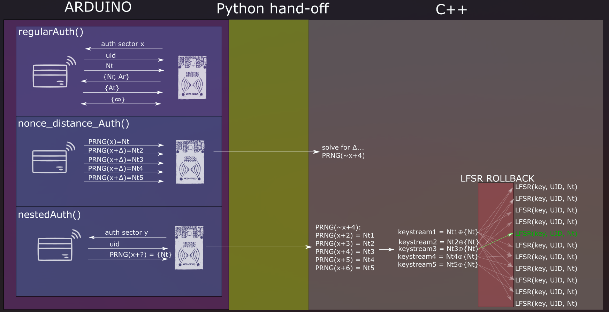
    
<h3>Alternative title: How I did something in 2 months that some random Eastern-European did in one afternoon.</h3>

        I'm going to be trying to explain the nested authentication attack on a deeper level, showing you why it
        works. 

        A big challenge in writing this article is to present the whiteboard of all the required knowledge in a
        digestible
        manner that is not too dry, but since this is the deep dive, it will necessarily be a long article.

    
This article is for Cybersecurity enthusiasts, specifically people who are interested in RFID.
    

    
Specifically: if you just bought an Arduino UNO Starter kit, hooked up the included MFRC522 reader to your board,
        and
        started tapping away with random cards scattered around your desk and discovered that some of your cards were
        encrypted,
        even more specifically, if you discovered that one of the cards was a MIFARE Classic 1K, then this is the
        article for
        you. So, with this refinement in mind:

    
Reading this article will help you understand how to conduct your own Crypto1 nested
        authentication attack on a MIFARE
        Classic 1K card.

    
Specifically, what inspired me to write this article is seeing how utterly insane theory is translated into
        actionable
        programming code.

    <h2>MIFARE Fundamentals</h2>
    
MIFARE is a brand of contactless cards manufactured by NXP Semiconductors. They are designed to adhere to the
        ISO/IEC
        14443 Type-A 13.56 MHz standard. One of the early MIFARE models was the MIFARE Classic. These originally came
        with only
        1,024 bytes of data storage, hence the full name MIFARE Classic 1K. This is the card we are attacking today.

        MIFARE Classic 1K cards (MC1K) cards have data on them. It is laid out in 16 sectors, each comprising of 4
        blocks. This
        means the entire card has a storage space consisting of blocks 0-63. It looks like this:

    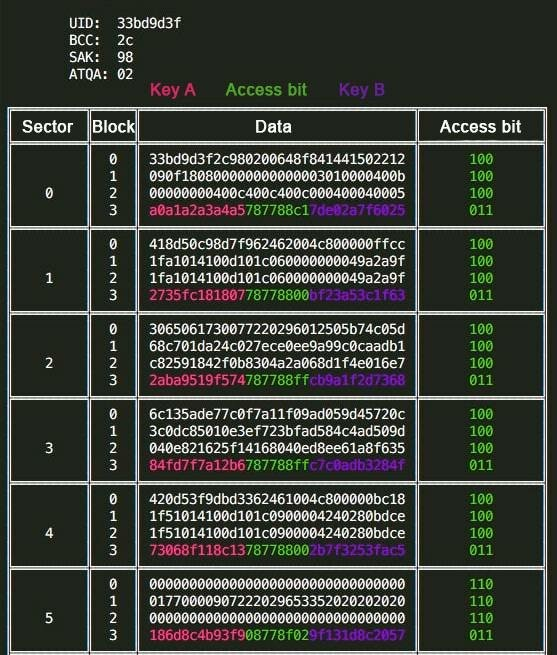
    
Realistically, your eyes only need to look at the data column, and note that each sector is organised in four 16
        byte
        rows. Of these four rows, the last (fourth) row of each sector is not a data row, it is called a sector trailer,
        and it
        stores data that governs what credential can access the data for that sector. Think of it like a mini access
        control
        list.

    <h2>MFC1K Keys</h2>
    
MFC1K uses two keys. They are called Key A and Key B. In the above photo, the red numbers correspond to Key A,
        and the
        purple numbers correspond to Key B. The green numbers represent a type of bitmask that once decoded, will reveal
        which
        key has what permission on the sector.

    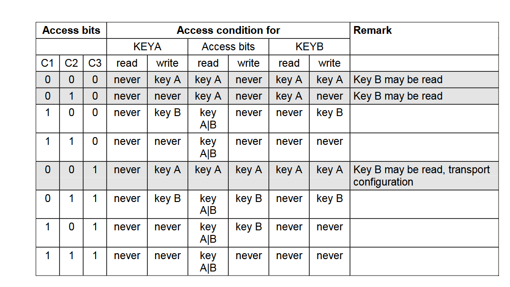
    
As seen in the above photo. Sometimes a sector is only readable if you supply Key A. Sometimes only with Key B.
        Sometimes you can only write into that sector with Key B. It is all dependent on the access bits.

    
    <h2>Radio communication note</h2>
    
MFC1K is based on the ISO 14443-Type A standard, which establishes a protocol for implementing reader-card
        communications. This is the protocol that necessitates readers send a REQA frame to cards in the range of its
        antenna,
        if it wishes to establish a session with it, for example.

        To aid security and prevent infantile eavesdropping attacks, MIFARE Classic readers and cards establish a layer
        of
        encryption on top of the ISO standard, called Crypto1.

        So the communication landscape is based on framing protocols and specifications established by ISO 14443-Type A,
        which
        is then encrypted and decrypted with NXP's propietary Crypto1 algorithm.

    <h1> Crypto1</h1>
    
Crypto1 (C1) is a stream cipher. Stream ciphers work on a very simple relation:

    
ciphertext = plaintext ⊕ keystream

    
If you have plaintext bits 101110 (0x2e), and wish to encrypt it, you must generate that many keystream bits, and
        apply
        a bitwise XOR. Say we generate the keystream bits 100101. The operation to perform this encryption step is thus:
    

    

        101110 
        100101 
        ------ 
        001011
    

    

        Most stream ciphers differ only in the way they generate those keystream bits.
    

    <h2>LFSRs</h2>
    
Linear Feedback Shift Registers (LFSRs) are a type of function that take a number of inputs to produce an output.
        Once
        this output has been produced, all the values in the function shift left or right by one position, and the data
        that was
        kicked out is replaced. I shall construct an example.

        Here is our LFSR at state 0, imagined as an array.

        [0, 0, 0, 0, 0, 0, 0, 1, 0, 0, 0, 0, 0, 0, 0]

        You may have noticed I said "number of inputs". These are called taps and are strategically elected positions in
        the
        LFSR to be queried for calculation of a final output value. Let's say our taps are at indexes 1,4,7,9,13. That
        would
        mean these positions:

        [0, 0, 0, 0, 0, 0, 0, 1, 0, 0, 0, 0, 0, 0, 0]

        Simply XOR them together:

        0 ⊕ 0 ⊕ 1 ⊕ 0 ⊕ 0 = 1

        This is your output.

        and then shift everything left.

    

        [0, 0, 0, 0, 0, 0, 0, 1, 0, 0, 0, 0, 0, 0, 0] 
        [0, 0, 0, 0, 0, 0, 1, 0, 0, 0, 0, 0, 0, 0, ?]
    

    
And then you take the value at the taps to generate the next bit, and shift again. But if you're shifting left,
        what do
        you put in place? It can't just be empty space. But it also can't just be zeroes, since after 15 left-shifts
        your LFSR
        will be all zeroes. This is the role of the generator function, and is what governs what number will replace the
        position that was evacuated by the left or right shift.

        In our example, let's say our generator function has taps at 1 and 7 only.

        then it's 0⊕1 = 1.
    

        [0, 0, 0, 0, 0, 0, 0, 1, 0, 0, 0, 0, 0, 0, 0] 
        [0, 0, 0, 0, 0, 0, 1, 0, 0, 0, 0, 0, 0, 0, 1]
    

    
This is in essence all that is needed to understand the C1 LFSR. Here is the summary of how the LFSR works:

    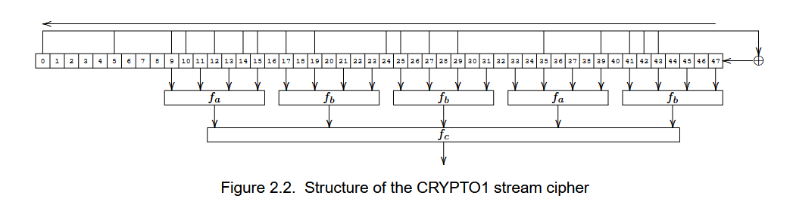
    

        Now, here's the precise definition of how the C1 Cipher implements the generator polynomial and feedback taps:
    

    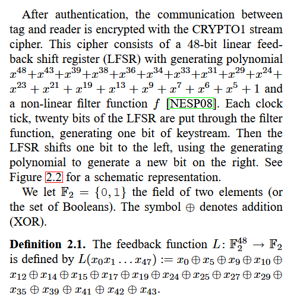
    

        Here's what's new.

        Our previous example used an array of 15 spaces. the C1 LFSR uses a 48-bit number, which can be crowbarred back
        into our
        example by imagining the LFSR as an array of 48 slots, each holding 1 or 0.

        The mathematical term for the generator function is actually a generator polynomial, but due to mathematical
        operations
        in a Galois field with two elements GF(2), it can still be examined as a xor at specific positions in a
        number/array. So
        in the photo above, our generating taps are at bit positions 48,43,39,38 . . . 5, 0. In fact, it is conveniently
        restated a paragraph later, just going the opposite way.
    

    
The function that produces the output bit, however, is a little wordy:

    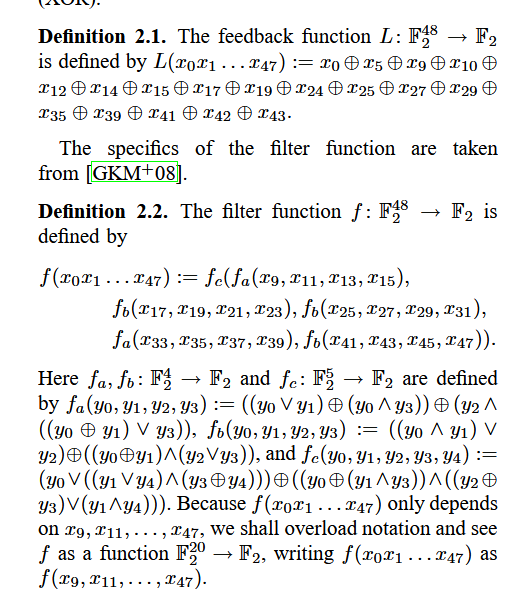
    
This is to say:

        "The filter function f takes 48 inputs from a possible set of values spanning two elements (1 and 0) and
        produces 1
        output within the same 2-element set."

        "f works by supplying it 48 inputs, which we name x0, x1, x2 ... x47."

        "f then uses these inputs and calls three other functions fA, fB, and fC in this manner"

    

        f = fC (
        fA(x9,x11,x13,x15),
        fB(x17,x19,x21,x23),
        fB(x25,x27,x29,x31),
        fA(x33,x35,x37,x39),
        fB(x41,x43,x45,x47)
        )
    

    

        "fA is defined by XOR, AND, OR operations on its members y0,y1,y2,y3 like so"
    

    

        fA(y0,y1,y2,y3) =
        (
        ((y0 | y1) ⊕ (y0 & y3))
        ⊕
        (y2 | ((y0 ⊕ y1) or y3))
        )
    

    

        "fB is defined by a similar spaghetti of operations"

        "so is fC"

        "Because f only uses the top 20 elements supplied to it, we can compress the notation and establish that
        whenever we
        mention f, we are talking about the top 20 elements"
    

    
    

        Yes its wordy, and a little intense. But work through it slowly. Moving on, its one thing to understand the theory, but to see how it actually manifests in code?
        Well
        here it is:
    

    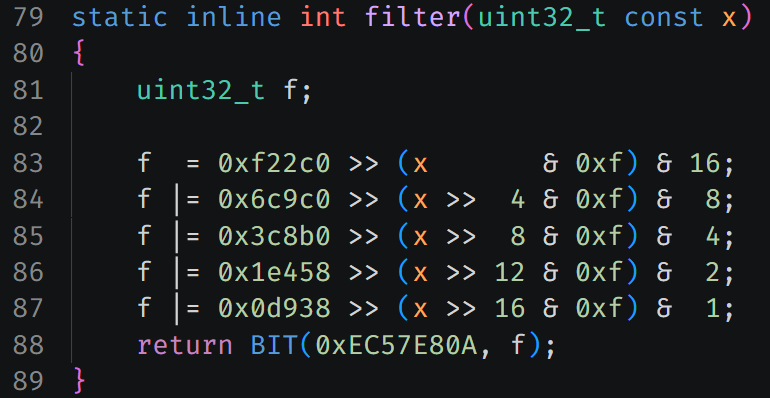
    
If you were asked to implement the theory into code, maybe you would take the function definitions literally, and
        define
        fA, fB, fC to take 4 inputs, XOR/AND/OR with the inputs and give an output. But the authors of crapto had a more
        elegant
        solution.

    

        First, we need to remember that the overall definition was able to be compressed into 𝔽²⁰₂→𝔽₂, meaning its
        possible to
        call our function with a uint32_t as input, and just ignore the top 12 bits.

        Second we define a uint32_t to hold the output of our "functions".

        Lets look at the first assignment to f:
    

    

        f = 0xf22c0 >> (x & 0xf) & 16;
    

    

        First, one must look at the 0xf22c0 constant used in this calculation. It is a type of boolean look-up table. If
        you
        represent the number in binary:
    

    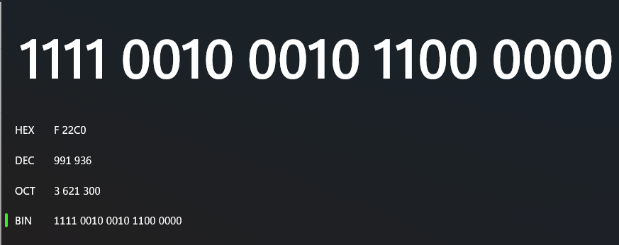
    
You will see 1111 0010 0010 1100 0000.
        Since the fA and fB functions are defined by 𝔽⁴₂→𝔽₂, it is clear that they take 4 elements of input from the
        set
        {0,1}, and output a single element.

        Taking a look at fB this time, the arithmetic involved in calculating the output element for the fB function is:
    

    
fb(y0,y1,y2,y3) = ((y0 ∧ y1) ∨ y2) ⊕ ((y0 ⊕ y1) ∧ (y2 ∨ y3))

    
Well, if you only have 4 inputs, where each only takes the form of 0 or 1, you have a 16 element sample space,
        and means
        that the fB function is completely deterministic like so:

    

    <table border="1">
        <thead>
            <tr>
                <th>n</th>
                <th>y0</th>
                <th>y1</th>
                <th>y2</th>
                <th>y3</th>
                <th>fa</th>
                <th>fb</th>
            </tr>
        </thead>
        <tbody>
            <tr>
                <td>0</td>
                <td>0</td>
                <td>0</td>
                <td>0</td>
                <td>0</td>
                <td>0</td>
                <td>0</td>
            </tr>
            <tr>
                <td>1</td>
                <td>0</td>
                <td>0</td>
                <td>0</td>
                <td>1</td>
                <td>0</td>
                <td>0</td>
            </tr>
            <tr>
                <td>2</td>
                <td>0</td>
                <td>0</td>
                <td>1</td>
                <td>0</td>
                <td>0</td>
                <td>1</td>
            </tr>
            <tr>
                <td>3</td>
                <td>0</td>
                <td>0</td>
                <td>1</td>
                <td>1</td>
                <td>1</td>
                <td>1</td>
            </tr>
            <tr>
                <td>4</td>
                <td>0</td>
                <td>1</td>
                <td>0</td>
                <td>0</td>
                <td>1</td>
                <td>0</td>
            </tr>
            <tr>
                <td>5</td>
                <td>0</td>
                <td>1</td>
                <td>0</td>
                <td>1</td>
                <td>1</td>
                <td>1</td>
            </tr>
            <tr>
                <td>6</td>
                <td>0</td>
                <td>1</td>
                <td>1</td>
                <td>0</td>
                <td>0</td>
                <td>0</td>
            </tr>
            <tr>
                <td>7</td>
                <td>0</td>
                <td>1</td>
                <td>1</td>
                <td>1</td>
                <td>0</td>
                <td>0</td>
            </tr>
            <tr>
                <td>8</td>
                <td>1</td>
                <td>0</td>
                <td>0</td>
                <td>0</td>
                <td>1</td>
                <td>0</td>
            </tr>
            <tr>
                <td>9</td>
                <td>1</td>
                <td>0</td>
                <td>0</td>
                <td>1</td>
                <td>0</td>
                <td>1</td>
            </tr>
            <tr>
                <td>10</td>
                <td>1</td>
                <td>0</td>
                <td>1</td>
                <td>0</td>
                <td>0</td>
                <td>0</td>
            </tr>
            <tr>
                <td>11</td>
                <td>1</td>
                <td>0</td>
                <td>1</td>
                <td>1</td>
                <td>1</td>
                <td>0</td>
            </tr>
            <tr>
                <td>12</td>
                <td>1</td>
                <td>1</td>
                <td>0</td>
                <td>0</td>
                <td>1</td>
                <td>1</td>
            </tr>
            <tr>
                <td>13</td>
                <td>1</td>
                <td>1</td>
                <td>0</td>
                <td>1</td>
                <td>0</td>
                <td>1</td>
            </tr>
            <tr>
                <td>14</td>
                <td>1</td>
                <td>1</td>
                <td>1</td>
                <td>0</td>
                <td>1</td>
                <td>1</td>
            </tr>
            <tr>
                <td>15</td>
                <td>1</td>
                <td>1</td>
                <td>1</td>
                <td>1</td>
                <td>1</td>
                <td>1</td>
            </tr>
        </tbody>
    </table>

    

    
Now, time for the aha moment. Look what happens if you add up all the outputs bottom-up:

    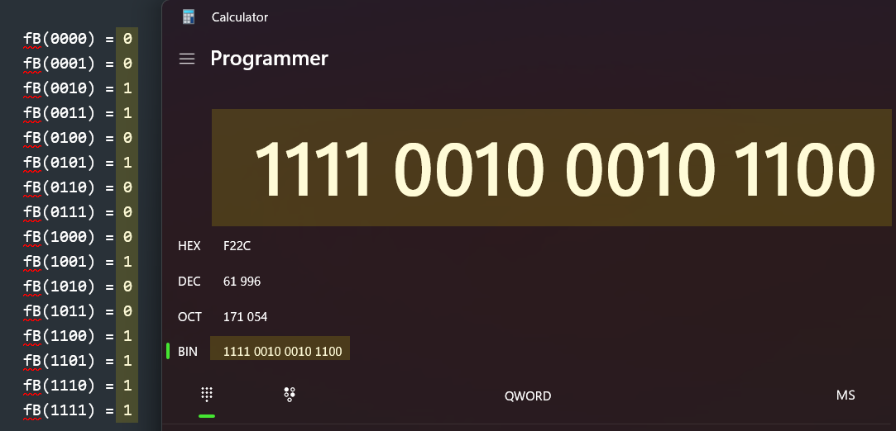
    

        You get the 0xf22c0 constant from earlier (the 0 is added in as an extra trick to get the resultant bit into the
        correct
        spot for the final f variable).

        And thus, going back to this line:
    

    

        f = 0xf22c0 >> (x & 0xf) & 16;
    

    

        What it is doing, is comparing the low 4 bits of the supplied 20 bits, figuring out the pre-computed output
        through the
        0xf22c0 constant, and placing it in the correct place within the f variable.

        I won't go any further for this function since there is a lot to get through.

        But that is in essence the C1 LFSR defined in theory, and then a peek at how its implemented in code.
    

    <h2> Card PRNG</h2>
    

        The C1 cipher is involved in encryption and decryption, but there is another element in the puzzle. The MIFARE
        Authentication protocol involves a 4-way handshake where various nonces are exchanged. The first of these nonces
        must
        come from the card, and must be sufficiently random to be considered secure. It achieves this nonce generation
        with
        another, but smaller LFSR:
    

    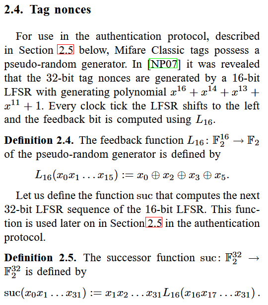
    
This should look a little familiar. The main difference is that the LFSR is only 16-bits large, and the filter
        function
        f is replaced by a suc function (short for successor) which has a different domain and co-domain to f. Recall
        that f had
        the properties of 𝔽²⁰₂→𝔽₂. But the suc function works a little differently: it takes 32 elements of input from
        the set
        {0,1}, and outputs 32 elements from the same set. This is to say, that

    
the suc function is based on a 16-bit LFSR, that generates 32-bit numbers.

    

        16-bits is not a lot. A 16-bit LFSR means that the LFSR can be entirely represented by a number like 0xABCD.

        This also means that the LFSR only has 2^16 = 65,535 possible unique states to cycle through before repeating.

        As the paper states, given the ISO 14443-3 bit-period of 9.44μs, the whole LFSR cycles through every
        single
        possible permutation in about 618ms, meaning there are some swanky timing attacks that are possible.

        Here is the real-life function for the suc function from the paper:
    

    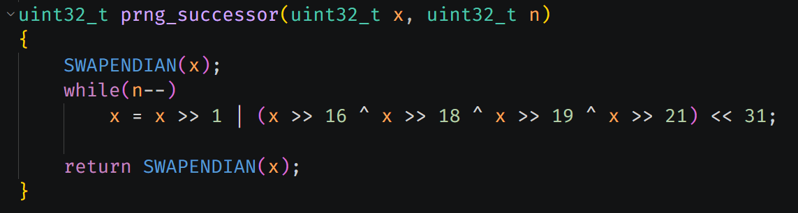
    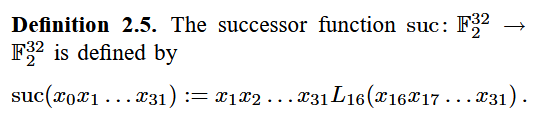
    

        The trick to understanding the function is to note that suc(x0,x1...x31) goes in, but the function then
        left-shifts, and
        thus the output is missing the x0 that went in. Do you see it? Then the suc function becomes clear. It shifts
        right
        (because the paper is big-endian, the C implementation does it in little-endian), computes the tapped positions,
        and
        then adds the new bit at the front.

        The suc function is largely our only tool to ensure that we are implementing the C1 cipher correctly, and that
        our
        arithmetic checks out. As you will see later on, our cryptographically derived values are checked against
        various
        iterations of suc(Nt nonce, cycle amount).
    

    <h2> Authentication process </h2>
    

        As mentioned earlier, the MIFARE Classic authentication process is a 4 step process after preliminary
        card-selection and
        anticollision phases are established.
    

    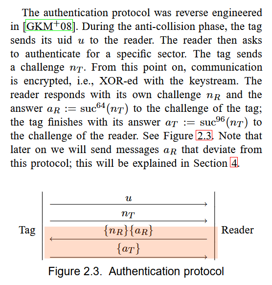
    

        I've highlighted in red in Figure 2.3. which part of the communication process is encrypted.

        What this 4 way handshake establishes, is a synchronised C1 LFSR between the card and the reader. Whenever
        either party
        encrypts or decrypts something, both parties will advance their LFSR by a certain amount of cycles. If they do
        this in
        lockstep, then at every point in time, both of the LFSRs they respectively hold in their own memories will
        "answer" to
        each other's message perfectly.

        How is this synchronised state established?
    

    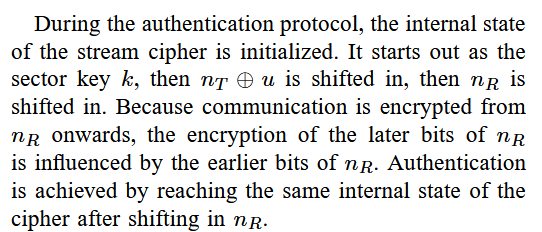
    

        So, fundamentally, since this is an authentication request, it stands to reason that the reader should know the
        key
        already.
    

    
"During the authentication protocol, the internal state of the stream cipher is initialized.
        It starts out as the sector
        key k"

    
Here is where that's done in code:

    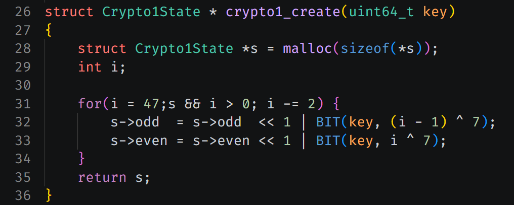
    
 and Crypto1State itself: 

    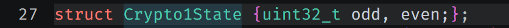
    

        Here is where imagining the LFSR as an array, or a big number is discarded in the interest of efficient
        computation. It
        is evident from the earlier defined functions, that the operations more often than not are only defined for the
        odd
        positions of the LFSR.
    

    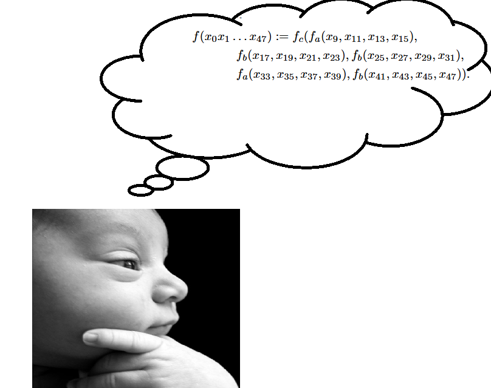
    

        Hence, it is expedient to store the LFSR as a struct with two 32 bit numbers, each representing an interleaving
        between
        the even and odd positions of a larger uncombined 48 bit key (i.e., 24 bits are odd, 24 bits are even), so that
        they can
        be accessed at will, rather than iterated over.
    

    
I won't go into much detail for the crypto1_create() function because I want to keep the ball rolling. Get your
        favourite LLM to summarise it for you.

    <h2> regularAuth </h2>
    

        This is our bread-and-butter authentication function done manually with the use of raw-packed frames with
        in-house CRC
        and parity-bit generation. The MIFARE authentication protocol specifies an odd-parity bit for each byte
        transmitted over
        the air. That means that each byte transmitted over the air is in reality 9 bits.
    

    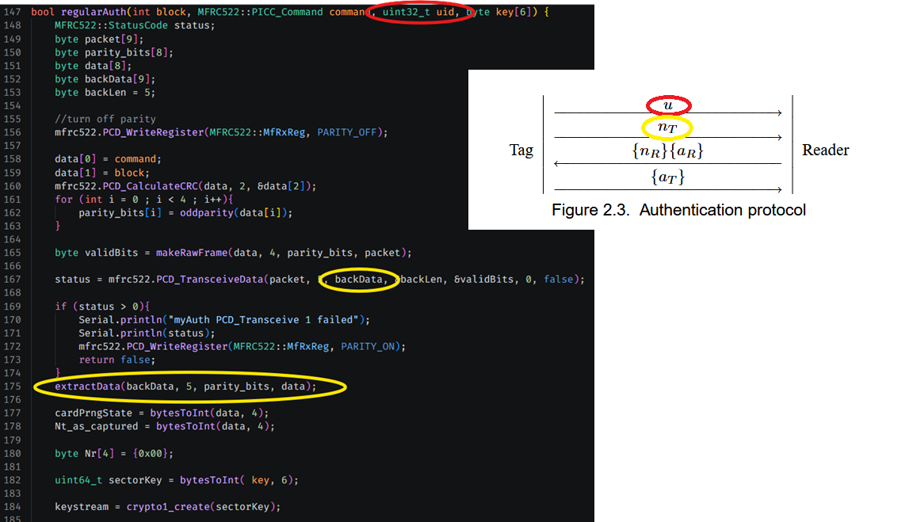
    

        The start of the function does what I talked about in the previous article: disable parity, and frame packing,
        and send
        initial request and catch reply. The red circle is the uid u. It is obtained from the anticollision phase. The
        yellow
        circles are concerned with capturing nonce Nt. After the transceive call it is stored as it was transmitted over
        the
        air, with parity bits and all. Extract data pares it and gives you the real value.

        Going back to what I started explaining; we have initialised the C1 LFSR with the key. We have uid, and we have
        Nt. This
        means we can do the next step of the LFSR state initialisation, which is:
    

    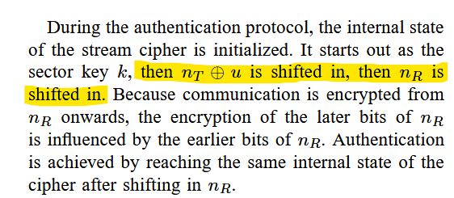
    

        We achieve this with this line:
    

    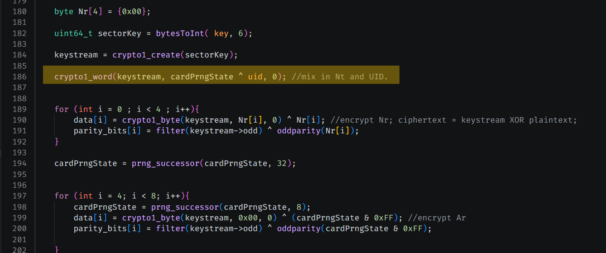
    

        crypto1_word is a word-level invocation of the fundamental crypto1_bit function, which generates a cycle of the
        LFSR -
        that is - a cycle that produces an output bit and a feedback bit. It takes a parameter called "in" which is
        where you
        get to manually add in bits to the usual tap-extraction step to further diversify the LFSR. However, it is
        important to
        stress that nothing new is happening. Both parties know the key, and the UID of the card, and therefore are able
        to do
        these steps independently and reach an identical state on their respective interfaces.

        With Nt and UID shifted in, there remains one variable to shift in, Nr.

        Nr is simply a reader-chosen nonce that both parties use to further dilute the LFSR. It can be any 4 bytes that
        you
        want. I (as others) chose to keep it simple with 4 zeroes. However, according to the authentication protocol,
        these must
        be encrypted, and this is done like so:
    

    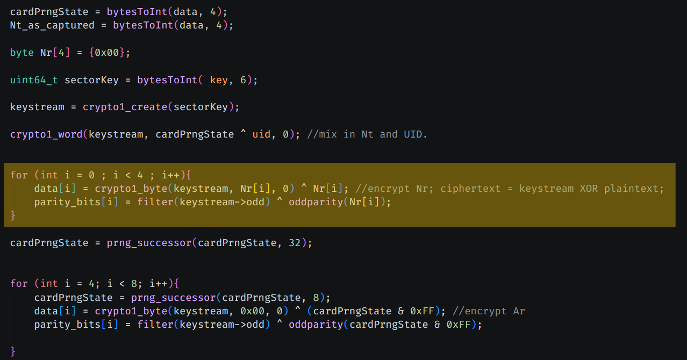
    

        Crypto1_byte() will output a byte after invoking the filter function over 8 bits. This is our keystream byte.
        This is
        coincidentally a good time to mix in Nr into the LFSR, so it is done now.

        Remember the simple relation: ciphertext = plaintext ⊕ keystream?

        Well, here, you get to see it exactly, wit the Nr[i] plaintext being XORed with the returned keystream byte from
        crypto1_byte().

        The next step computes the encrypted parity bits over the odd-parity of Nr. Remember that we've realised that
        the filter
        function only operates on the odd positions of the LFSR, and hence filter can be comfortably called only on this
        part.
    

     
    

        Here we see our first invocation of suc. This is needed because we need to generate a nonce called Ar which
        depends
        entirely on the output of suc after 64 cycles with the base value of Nt
    

    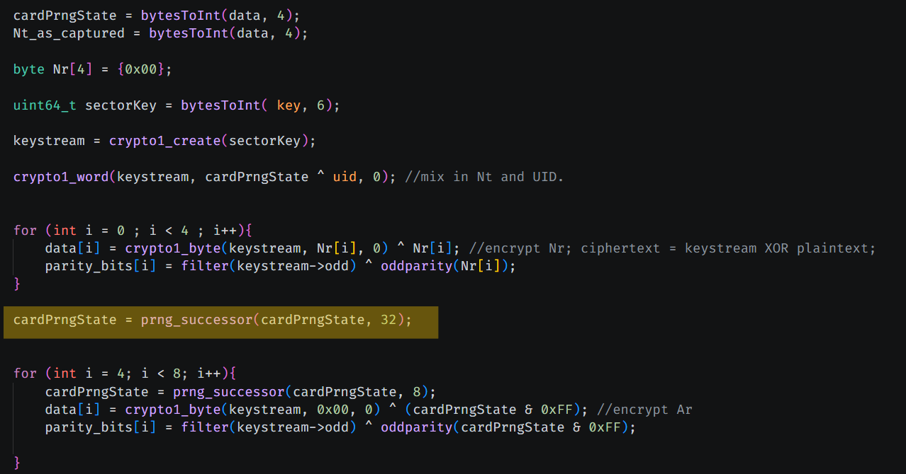
    

        Next, after successfully generating Nr, Ar, and encrypting them, we send them over, and capture the response.
        This
        response is At in our 4-step handshake
    

    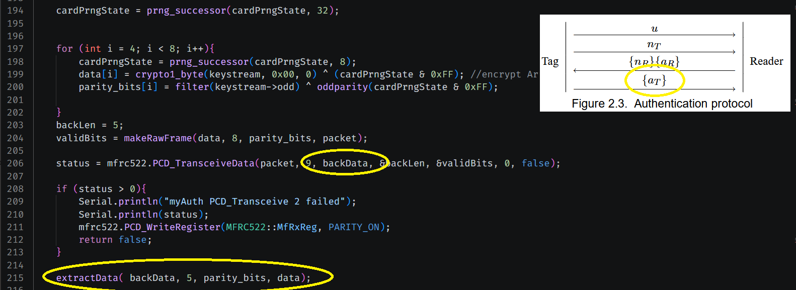
    

        However, recall that the nonces are encrypted at this point. This is no problem since both the reader and the
        card have
        properly synchronised C1 LFSRs.
    

    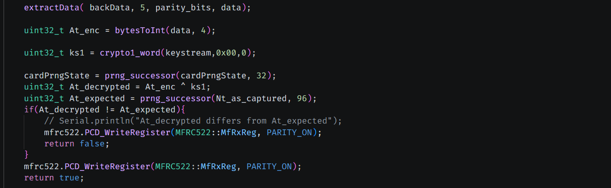
    
This code stores the encrypted At, generates a keystream to decrypt it, and then compares it to the expected
        value,
        which is clearly defined as:

    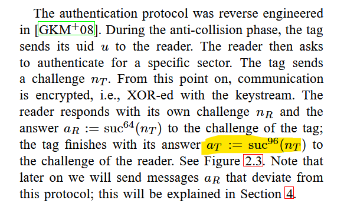
    

        And is why we compare our decrypted At to a manual suc(Nt, 96) call. If they match, everybody is happy and the
        card
        recognises our session as valid (loose way of saying it).
    

    
 The entire attack is based on this authentication function alone. So,
        understanding it is very vital to
        understanding how the attack works.

    

    <h2> The Nested Attack</h2>
    
 So, we know the MC1K format, the C1 cipher and the critically important LFSR structure. We also know the role of the 4 nonces Nt, Nr, Ar, At,
    what they relate to, and the various functions involved in their calculation. The next part of inquiry is the nested attack itself.
     
     
    The nested attack is based on two interplaying concepts:
    <li>Cryptographically weak practices in C1</li>
    <li>A weak PRNG on the card, based on its small LFSR</li>
    C1 has a problem in its parity bit encryption. As the paper states:
    

    
The ISO standard 14443-A [ISO01] specifies that
    every byte sent is followed by a parity bit. The
    Mifare Classic computes parity bits over the plaintext
    instead of over the ciphertext. Additionally, the bit of
    keystream used to encrypt the parity bits is reused to
    encrypt the next bit of plaintext.

    
 This manifests in our attack by helping reduce the keyspace to search. We can eliminate a non-trivial amount of candidates with this weakness, speeding up our attack.

    
The second vulnerability - weak card PRNG - is the actual driver of the attack. When we establish a validly authenticated session to a sector, we can encrypt and decrypt frames between the card and reader. If we were to request authentication to a different sector, the Nt nonce would be sent over encrypted. This encryption wouldn't be in the current C1 state context. The card would actually reinitialise its own C1 state, with the same parameters as first time: 

    
Crypto1State(UID, key, Nt)

    
The exact crux of the nested-auth attack lies in the fact that we can predict Nt, and remembering: 

    
ciphertext = plaintext ⊕ keystream and thus keystream = plainNt ⊕ encryptedNt

    
we can XOR the sent encrypted Nt with our predicted Nt to reveal what 32 bits of keystream were used to encrypt Nt. Critically, these 32 bits of keystream <i>constrain</i> the amount of mathematically valid LFSR states that could've been used to call the filter function 32 times in a row. It's a big set, but it's still a contained set. Since the generator function / feedback function is deterministic, applying the same functions in reverse allows you to "unroll" or roll-back the LFSR to its original initialisation which was initialised with a UID, key, and an Nt.   
    This is where the parity weakness observed above can help us; by reducing the candidate LFSR list. If we manage to reduce the LFSR search to something sensible, and continually roll back candidate LFSRs to recover keys, eventually the same few keys will be reappearing at the end of the rollback functions. These are the keys that present the highest probability of being the sector key.
    

    
Lastly, we need to talk about nonce distance. The card PRNG is clocked in 9.44μs cycles. With no other initialisation independent variables present in Nt nonce generation, there is a calculable cycle-distance between two nonces. Therefore, if we record a number of transactions, and work out the nonce distance in each one, we establish an average nonce distance variable. We can then use that average nonce distance with a tolerance parameter (needed because RF communication can be jittery) to simulate clocking the PRNG cycle ourselves by that distance, to try and "snipe" the Nt it could have generated. This is precisely the mechanism used to generate our predictions for the chosen plaintext+ciphertext attack outlined above.

    <h2>Bringing it all together</h2>
    
 Our attack works in three main parts:

    <ol>1.  <b>Nonce distance calculation</b> 
    <ul> nonce_distance_Auth(), regularAuth()</ul></ol>
    <ol>2. <b>Nested authentication</b>
    <ul> nested_Auth()</ul></ol>
    <ol>1. <b>LFSR rollback and candidate generation</b>
    <ul> c++ -> generatePossibleKeys(), findKey()</ul></ol>
    
 Here is a battered rendition of the attack - missing the minutae of function calls - however I think it illustrates the flow.

    
    <h2>Nonce distance</h2>
    
Our nonce distance calculating function starts off by resetting the state of the card and reader, to initiate a brand-new authentication state. It establishes an initial correct state to a known sector.

    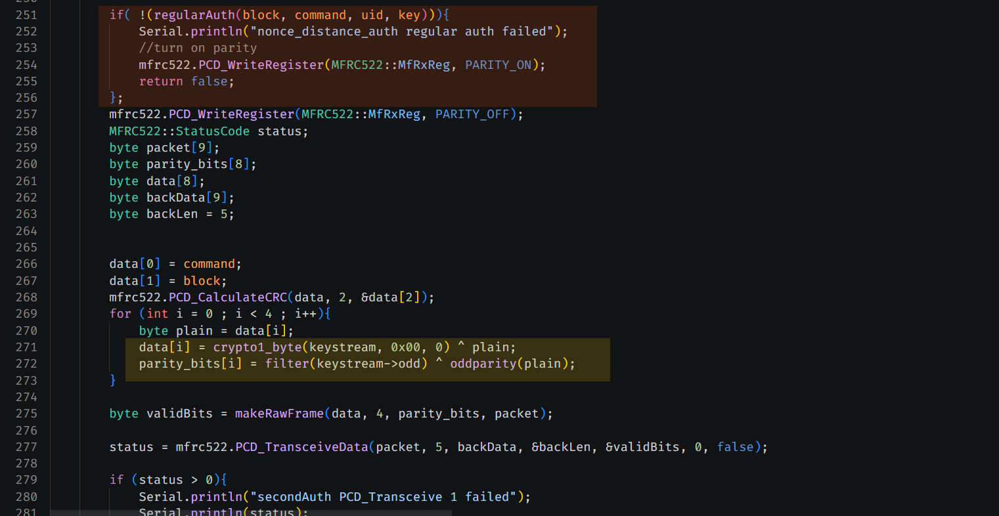
    
Since we are operating in the context of a correct authentication state, all of our communiques must be encrypted, and that is what is happening in the yellow box.

    
After submitting a successful auth attempt to the <b>same</b> sector, we capture it and decrypt it, so that we can compare the Nt nonce from authentication context 1, to authentication context 2.

    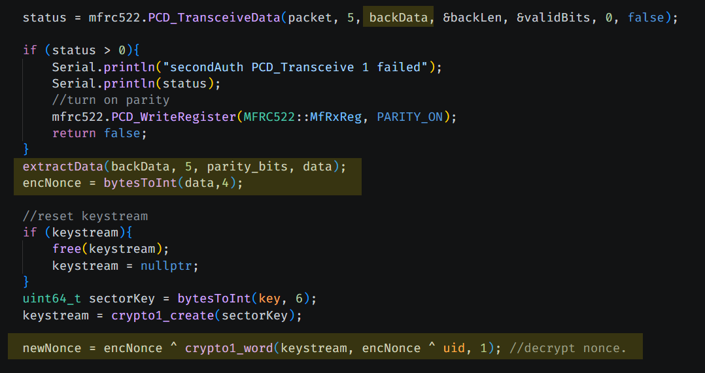
    
Once we have our nonces, we hand off to Python, which is listening on COM3:

    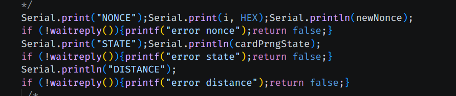
    
Our python COM3 Serial listener is very self-explanatory. It receives sent bytes and acts based on the beginnings of the frames. The C++ hot-loops are invoked in specific spots in the program.

    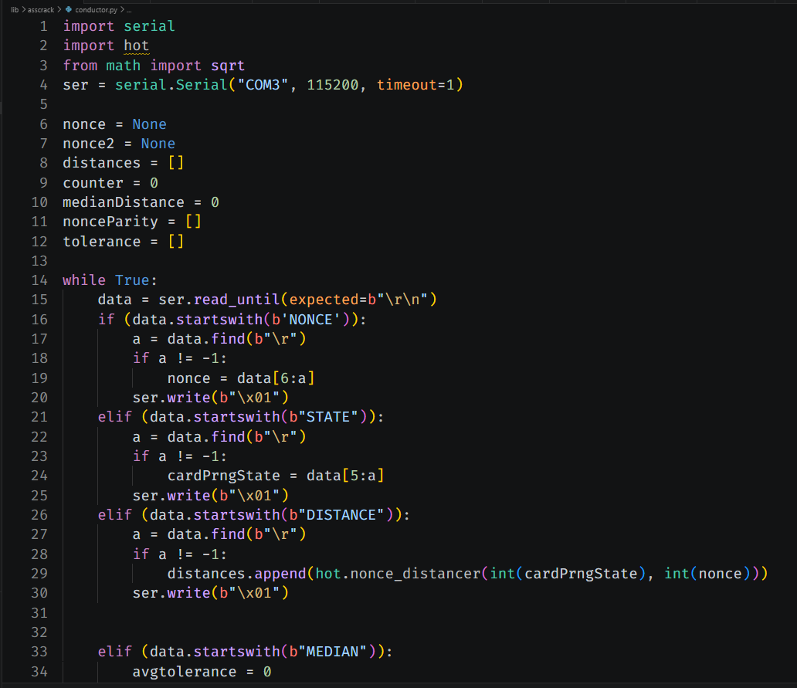
    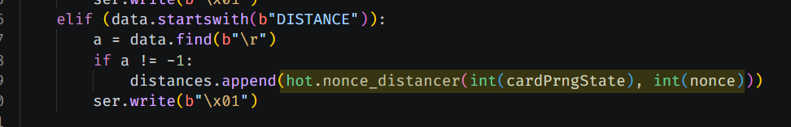
    
 The nonce distance section is basically as simple as that. At the end, we will have a number in the memory of the python process like 5023, or 7410. The rest of our attack is completely reliant on this number being correct, so if this program doesn't work, the first culprit to check is the nonce distance.

    <h2>Nested auth and hot loop</h2>
    
 This is the real meat and potatoes of the attack. The arduino side is the simplest: 

    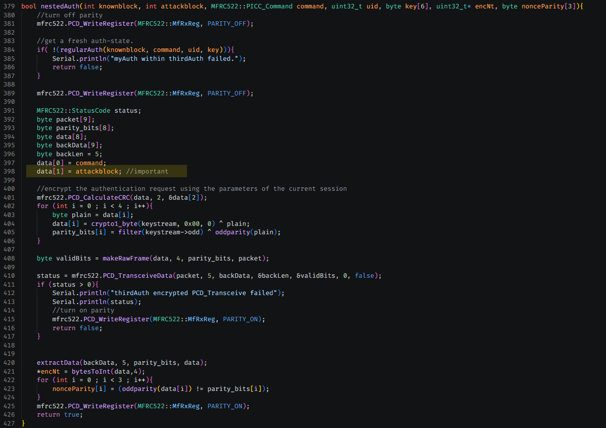
    
 This is probably more of a reflection on my terrible coding practices, but <i style="color:beige"> this should already look very familiar </i>. As I've highlighted, the most important part is that the second authentication attempt must be to the sector you wish to attack.

    
 After this function captures and stores the relevant variables, it ports them all over to the python side, and then after some data processing, invokes the C++ function responsible for rolling back the LFSRs and giving us some key candidates. The python side is child's play, so I shall skip straight to the C++

    <h2>C++ Hot loops</h2>
    
 Before I go on, I must stress that most of this code is not mine. My only addition/change in hot.cpp is the use of STL data types in filtering out the candidate keys through my findKey() function

    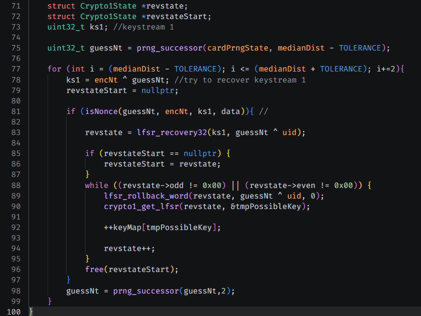
    
We begin by initialising two new C1 state structures. Then, comes the crux of this whole article: 
        
uint32_t guessNt = prng_successor(cardPrngState, medianDist - TOLERANCE);

    This line is exactly what we were talking about earlier with nonce distances, guesses, and predictions. We use the currently known and established card PRNG state to use prng_successor to cycle forward to the bottom-bound of our medianDist tolerance interval. With any luck, as we move through the for-loop, one of those medianDists will correspond to the real Nt.
        
ks1 = encNt ^ guessNt;

    This line now does the 32 bit keystream prediction. The rest of the function rolls back the resultant LFSR states until it ends up with a key. Reminder: this is unlikely to be the correct key straight off the bat - there are many different possible solutions at any given time. It is the repeated identification of the same solution over many runs that grants it credibility of being the correct key. 
    As the function ends, the guess is iterated forward, and the process is repeated. At the top of the file there is a tolerance DEFINE statement. Change this to your needs if the tolerance is too wide or too narrow.
    

    
And now, we come to the final piece of the puzzle. This is where I stray heavily from the reference material and implement my own candidate key search, using an unordered map and set. This is the main reason why I needed to offload the computation process from the Arduino in the first place. The Arduino has limited memory and processing power, let alone access to the C++ STL data types. I think it was necessary. This function picks the most popular key and sends it back to the Arduino to try and do a regular auth with. If its successful, it moves on to the next sector (hence the mess of for-loops and break statements), if its not, it simply tries again.

    <h2>Concluding statements</h2>
    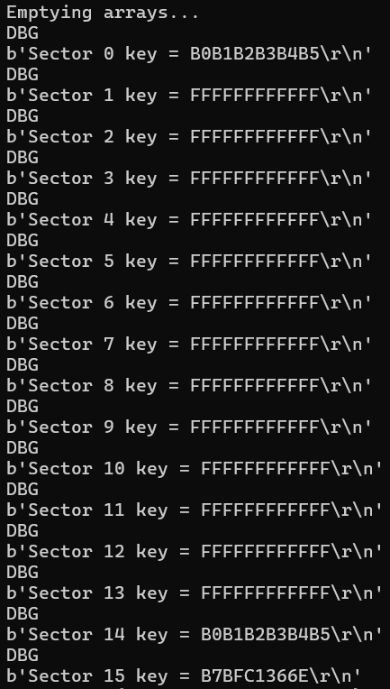
    
This was a very fun project that took me some time, but I learned a lot. Programming wise, I have never written firmware before, and it's probably obvious, however, I am glad I chose to do this the hard way and stuck with it rather than just buying a ProxMark3 and firing off some script made by someone else. It's much more satisfying this way.

    
 And to those who know CAD, MAD and the Gallagher application layer in MIFARE: Shush. Let me have my moment

    

</body>
